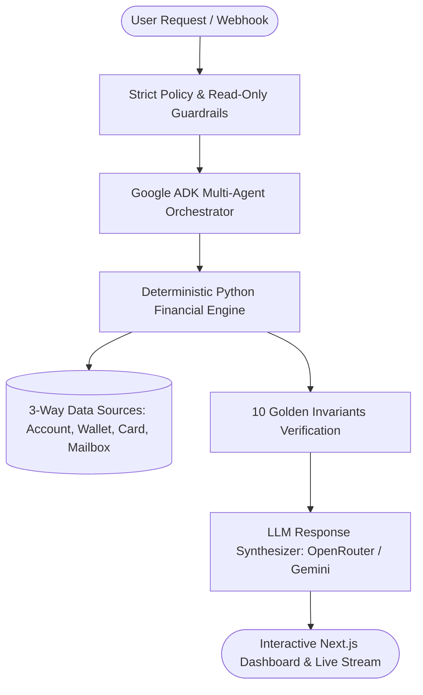
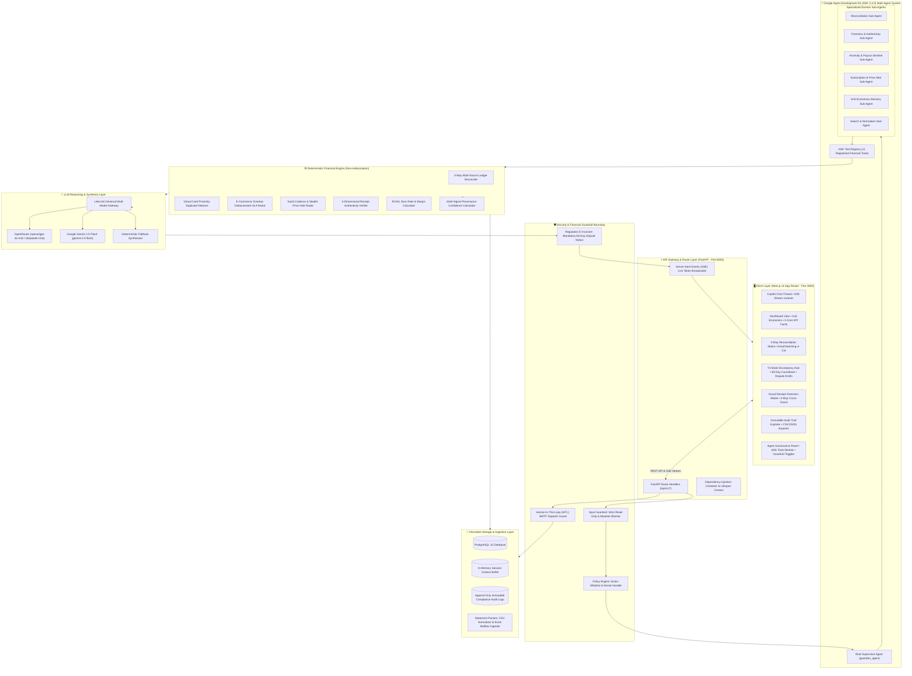
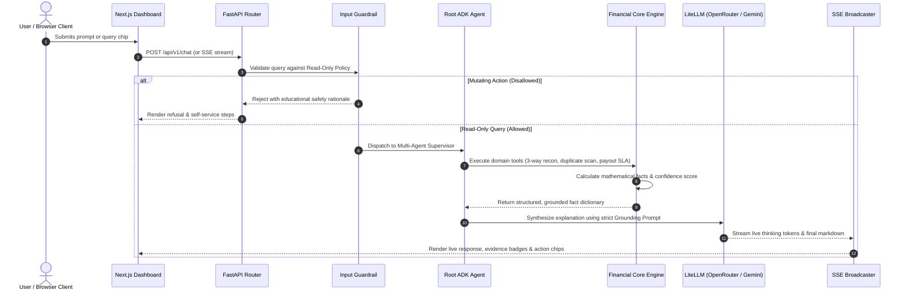

# Wealify Guardian — Enterprise AI Financial Copilot & Transaction Safety Microservice

[](https://github.com/wealify/guardian/actions)
[](https://opensource.org/licenses/MIT)
[](https://www.python.org/)
[](https://fastapi.tiangolo.com)
[](https://nextjs.org/)
[](https://ai.google.dev/)
[](https://www.docker.com)
[](https://openrouter.ai)

---

## Table of Contents

- [1. Problem Background and Context](#1-problem-background-and-context)
- [2. Core Problem and Market Pain Points](#2-core-problem-and-market-pain-points)
- [3. Architectural Breakthroughs and Core Philosophy](#3-architectural-breakthroughs-and-core-philosophy)
- [4. The 10 Golden Invariants](#4-the-10-golden-invariants)
- [5. Solved Happy Cases and Demonstration Scenarios](#5-solved-happy-cases-and-demonstration-scenarios)
- [6. Complete User Guide and Operational Walkthrough](#6-complete-user-guide-and-operational-walkthrough)
- [7. System Architecture and Multi-Agent Design](#7-system-architecture-and-multi-agent-design)
- [8. Quickstart Guide](#8-quickstart-guide)
  - [1-Click Docker Compose Launch](#1-click-docker-compose-launch)
  - [Local Development Setup](#local-development-setup)
- [9. REST API and Stream Endpoints Reference](#9-rest-api-and-stream-endpoints-reference)
- [10. Quality Assurance, Testing, and Verification](#10-quality-assurance-testing-and-verification)
- [11. Repository Structure](#11-repository-structure)
- [12. License](#12-license)

---

## 1. Problem Background and Context

Cross-border e-commerce sellers, multi-brand digital marketing agencies, and global tech startups operate in a high-velocity financial ecosystem where capital moves across multiple fragmented channels simultaneously:

- **Pay-in**: Incoming venture capital, wire transfers, and currency top-ups.
- **Payout**: Multi-platform marketplace disbursements (Amazon Seller Central, Stripe, Shopify, TikTok Shop, Etsy, PayPal).
- **Transfer to Card**: Liquidity transfers allocated to hundreds of disposable or recurring virtual cards.
- **Service Fees**: Banking maintenance fees, foreign exchange (FX) spreads, and platform transaction surcharges.
- **Card Purchases & Ad Spend**: High-frequency advertising spend across Meta Ads, Google Ads, TikTok Ads, and recurring SaaS subscriptions.

In standard business operations, these transactions reside in isolated data silos: **Wealify Core Banking Ledgers**, **Bank and Virtual Card Statements (CSV/PDF)**, and **Corporate Mailboxes (Receipts, Invoices, Settlement Notices)**.

When discrepancies arise, business owners and accounting teams are forced to manually reconcile spreadsheets line-by-line across hundreds of obscure merchant abbreviations and asynchronous processing dates.

---

## 2. Core Problem and Market Pain Points

### Why Traditional Accounting Software Fails

1. **Passive and Retrospective**: Software such as QuickBooks or Xero only records what happened weeks after statement closing. They cannot proactively flag an ongoing duplicate charge or delayed payout in real time.
2. **Siloed Multi-Source Gaps**: Traditional platforms track bank accounts independently from virtual cards and email receipts. If a bank debit of $5,350.00 fails to credit a virtual card, it remains undetected until months later during manual tax audits.
3. **Cryptic Merchant Descriptors**: Bank feeds often list ambiguous descriptors (e.g., `ADBE*CREATIVE*981`, `MSFT*AZURE*E01`, `FACEBK*ADS*4812`), making automated categorization unreliable without mailbox evidence matching.

### Why Generic LLM Chatbots Fail

1. **Financial Hallucination**: Generative AI models routinely invent mathematical totals, miscalculate cash balances, and hallucinate merchant histories when ungrounded.
2. **Dangerous Mutations**: Unrestricted AI agents risk executing unauthorized fund transfers, card cancellations, or premature chargeback submissions without human consent.
3. **Missing Statutory Dispute Awareness**: Under **U.S. Federal Reserve Regulation E (12 CFR § 1005.11)** and standard interbank agreements, consumers and enterprises have exactly **60 days from the transmittal of the periodic bank statement** to formally dispute unauthorized charges or billing errors. Missing this statutory window forfeits all chargeback and refund rights permanently.

---

## 3. Architectural Breakthroughs and Core Philosophy

**Wealify Guardian** resolves the fundamental tension between autonomous AI intelligence and deterministic financial safety by enforcing a strict hierarchy of trust:

> **"LLM coordinates and interprets. Financial Engine calculates deterministically. Evidence proves provenance. Policy enforces safety boundaries. User retains final decision-making authority."**



### Breakthrough Innovations

1. **3-Way Multi-Source Invariant Engine**: Mathematically checks cashflow continuity across Account Statements, Wealify Wallet Ledgers, and Virtual Card Statements without relying on probabilistic model guesses.
2. **4-Dimensional Visual Receipt Forensics**: Cross-examines uploaded receipts and payment screenshots against (1) Reference Code, (2) Core Banking Ledger, (3) E-Wallet Deposit Records, and (4) Mailbox Ingested Evidence to calculate a calibrated **Conflict Score (0–100)**.
3. **Tri-State Standardized Alert System**: Every flagged anomaly strictly conforms to one of three standardized states:
   - `① Confirmed Recurring` (Định kỳ đã xác định)
   - `② Needs Confirmation` (Cần bạn tự xác nhận)
   - `③ Insufficient Data` (Chưa đủ dữ liệu)
4. **Zero-Hallucination Discrepancy Formulation**: If an unreconciled gap exists without clear attribution metadata, the agent explicitly outputs: *"Diff of $X between Source A and Source B — root cause undetermined"*.
5. **Strict Read-Only Enforcement & HITL**: Mutating financial operations (money transfers, card freezing, subscription cancellations) are strictly blocked with educational guidance. Email dispatching strictly requires Human-In-The-Loop (HITL) modal confirmation.
6. **Statutory 60-Day Countdown Automation**: Automatically computes and displays the U.S. Regulation E dispute deadline countdown for every flagged card transaction.

---

## 4. The 10 Golden Invariants

| # | Invariant Rule | Description & System Enforcement |
|---|---|---|
| **1** | **Strict Read-Only Execution** | The system is strictly read-only; it will never move money, freeze cards, or cancel subscriptions. |
| **2** | **Mandatory 60-Day Statutory Banner** | A non-dismissible header banner continuously reminds users of the 60-day dispute deadline from statement date. |
| **3** | **Tri-State Canonical Alerts** | Every alert is strictly classified into `Confirmed Recurring`, `Needs Confirmation`, or `Insufficient Data`. |
| **4** | **Zero-Hallucination Explanations** | Discrepancies without direct ledger evidence are strictly reported as "root cause undetermined". |
| **5** | **Canonical 4-Column Email Matching** | Always outputs: `Transaction`, `Mailbox Evidence`, `Result`, `Confidence`, and `Reason`. |
| **6** | **Human-In-The-Loop (HITL) Dispatch** | Financial reports and dispute drafts are only sent via SMTP upon explicit user modal confirmation. |
| **7** | **Deterministic Currency Reference** | Standardized exchange reference rate ($1 = 25,400₫) displayed across all views. |
| **8** | **Immutable Append-Only Audit Trail** | Every flagged transaction, classification, and confidence score is recorded for export. |
| **9** | **Proactive Background Scheduler** | Autonomous background monitor runs on interval with state snapshots and deduplication. |
| **10** | **Fully Bilingual UI (EN / VI)** | 100% of headers, badges, table cells, modal details, and notes translate instantly on toggle. |

---

## 5. Solved Happy Cases and Demonstration Scenarios

### Case 1: Overdue Multi-Day Amazon / Stripe Payout Radar
- **Trigger**: Amazon Seller Central confirms disbursement of **$4,250.00 USD** on 05/08/2026, but funds have not cleared in Wealify account after 16 days (Standard SLA: 3 days).
- **Engine**: `detect_overdue_payouts` cross-checks mailbox settlement notices against ledger credits.
- **Output**: Flags alert under `② Needs Confirmation`, displays `16 Days Overdue`, calculates remaining 60-day statutory dispute window, and auto-generates a ready-to-copy bank dispute letter.

### Case 2: Multi-Card Virtual Ad Spend Double-Charge Radar
- **Trigger**: Meta Ads executes 2 identical charges of **$150.00 USD** spaced only 105 seconds apart on virtual card `Volcano Ads •••• 4812`.
- **Engine**: `find_duplicate_charges` scans virtual card streams within time windows.
- **Output**: Identifies timestamp proximity, tags transaction as `② Needs Confirmation`, displays countdown (`12 days left`), and provides a pre-filled formal chargeback request draft.

### Case 3: Visual Forensics on Forged $2,500 Payment Screenshot
- **Trigger**: Counterparty uploads a wire transfer receipt screenshot claiming a **$2,500.00 USD** payment with reference `WF-839291`.
- **Engine**: `verify_transaction_authenticity` executes 4-way cross-check:
  - Reference Code: `WF-839291` not found in Core Banking.
  - Amount & Ledger: No incoming balance change of +$2,500.00 on 21/08/2026.
  - E-Wallet Balance: No matching top-up or transfer deposit.
  - Mailbox Confirmation: No bank transfer notification email received.
- **Output**: Computes a **92/100 Conflict Score** (`High Conflict`), classifies as `Needs user confirmation`, and advises holding fulfillment until actual settlement.

### Case 4: Stealth SaaS Subscription Price Hike Identification
- **Trigger**: Adobe Creative Cloud subscription quietly increases from **$49.99/mo** to **$54.99/mo** (+10.0%).
- **Engine**: `find_active_subscriptions` analyzes historical billing cadences.
- **Output**: Catalogs active subscriptions (Netflix $9.99, Adobe $54.99, OpenAI $20.00, Spotify $10.99), highlights stealth price increase, and projects **+$60.00/yr** annual budget impact.

### Case 5: 3-Way Cross-Ledger Flow Balancing (Account ↔ Wallet ↔ Card)
- **Trigger**: **$50.00 USD** debited from Account Statement on 18/08/2026 to fund Virtual Card, but card statement does not show credit.
- **Engine**: `reconcile_3way_transactions` computes net flows across Bank ($12,455.00 net), Wallet ($4,500.00 net), and Virtual Cards (-$1,240.48 net).
- **Output**: Pinpoints out-of-balance discrepancy: *"Diff of $50.00 between Account and Card Statement — root cause undetermined"*.

### Case 6: 4-Column Mailbox Invoice Matching
- **Trigger**: Cryptic statement charges (`ADBE*CREATIVE*CLOUD`, `AMZN*MKTP*US`) need verified invoice provenance.
- **Engine**: `reconcile_email_matches` extracts invoice dates, amounts, and sender domains from corporate inbox.
- **Output**: Generates canonical 4-column table: **Transaction**, **Mailbox Evidence**, **Result** (`Matched Email` / `Not Found`), **Confidence** (`96% High Confidence`), and **Match Reason**.

### Case 7: Real-Time AI Copilot with Streaming Execution Trace
- **Trigger**: User asks: *"How much did I spend this month and are there any duplicate charges?"*.
- **Engine**: Orchestrator coordinates Google ADK tools with LiteLLM (OpenRouter / Gemini) and live SSE streaming.
- **Output**: Displays live execution steps (`[Planner]`, `[Tool Execution]`, `[Data Grounding]`, `[Synthesizer]`) and renders markdown summary with interactive follow-up suggestion chips.

---

## 6. Complete User Guide and Operational Walkthrough

### 1. Navigation and Main Workspace

The application provides 5 user-facing financial workspaces and 1 administrative governance view accessible from the left sidebar:

- **💬 AI Copilot Chat (`/chat`)**: Interactive AI assistant for queries, instant calculations, receipt audits, and advisory.
- **⚠️ Discrepancy & Alerts Center (`/alerts`)**: Central tri-state alert hub with 60-day dispute countdowns and dispute drafts.
- **📊 Reports & Cash Flow (`/reports`)**: Multi-period cashflow breakdown (Monthly, Quarterly, Yearly), unit economics, and SaaS forecast.
- **📑 Ledger & Audit Trail (`/transactions`)**: Searchable multi-source transactions feed with normalizer explanations and CSV/JSON export.
- **⚙️ Agent Control Center (`/agent_control`)**: Administrator dashboard for reasoning models, guardrails toggles, and live ADK tool traces.

---

### 2. Step-by-Step Feature Walkthrough

#### A. Conversing with AI Financial Copilot
1. Select **AI Copilot Chat** in the left sidebar.
2. Click any of the quick-action prompt chips (e.g., *"How much did I spend this month?"*, *"Check payout disbursements"*, *"Scan double charges"*), or type a custom question.
3. Observe the live thinking trace accordion expanding into tool calling steps.
4. Review the structured markdown response containing tables, metric highlights, and clickable follow-up suggestions.

#### B. Thẩm Định Bằng Chứng & Ảnh Biên Lai (Receipt Verification)
1. In the chat bottom toolbar, click the **Verify Receipt / Thẩm định chứng từ** button (or click the Paperclip icon to attach a receipt image).
2. The **Evidence & Transaction Authenticity Audit Modal** will open.
3. Click on the sample receipt buttons for instant testing:
   - `⚠️ Fake Transfer Receipt ($2,500 USD)`: Simulates forged screenshot verification with high conflict score.
   - `✓ Adobe SaaS Invoice ($54.99 USD)`: Simulates valid invoice matching against ledger records.
4. Review the **4-Way Forensic Cross-Check dimensions** (Reference, Amount, E-Wallet, Mailbox).
5. Optionally enter an email address and click **Send via SMTP** to dispatch an audit report.

#### C. Tri-State Financial Alerts & Dispute Drafts
1. Navigate to **Discrepancy & Alerts** (`/alerts`).
2. Filter alerts using the category tabs: `All Alerts`, `① Confirmed Recurring`, `② Needs Confirmation`, `③ Insufficient Data`.
3. Locate alerts flagged with orange countdown badges (e.g., `Dispute window: 60 days`).
4. Click **Dispute Letter Draft** to preview the pre-filled formal bank dispute letter.
5. Click **Copy Dispute Draft** to copy the formatted text to clipboard.

#### D. Multi-Source 3-Way Reconciliation
1. Open the 3-Way Reconciliation view from the top header or dashboard.
2. Review the 3 Source Summary Cards:
   - **1. Account Statement** (Vietcombank): Total credits, debits, and net flow.
   - **2. Wallet Ledger** (Wealify USD): Top-up inflows and withdrawals.
   - **3. Card Statement** (Virtual Cards): Card spending and refunds.
3. Inspect the **Discrepancies & Integrity Check Table** for non-speculative discrepancy breakdowns.
4. Click **Re-run Reconcile** to trigger real-time ledger re-validation.

#### E. Email Receipt Matching (4-Column Format)
1. Open **Email Matching** view.
2. Filter results by status (`Matched Email`, `Not Found`, `Suspicious Fake`).
3. View the canonical 4-column layout mapping transactions to mailbox receipts with confidence percentages.

#### F. Financial Reports & Unit Economics
1. Navigate to **Reports & Cash Flow** (`/reports`).
2. Switch periods between `Monthly`, `Quarterly`, and `Yearly`.
3. View total income, operating spend, banking fees, and net surplus.
4. Inspect the **Top 3 Largest Expenses** and **Subscription Forecast & Price Hikes** panel.

#### G. Audit Trail & Compliance Export
1. Navigate to **Audit Trail** (`/audit`).
2. Search through historical logs by Log ID, Event Type, Reference, or Reason.
3. Click **Export CSV** or **Export JSON** in the top right to download full immutable compliance logs.

#### H. Agent Governance and Guardrails Configuration
1. Navigate to **Agent Control Center** (`/agent_control`).
2. Switch reasoning models: `Google Gemini 2.0 Flash` vs `Dual-Engine Deterministic`.
3. Toggle safety guardrails: `Strict Read-Only Mode` and `Enforce US Regulation E (60-Day Notice)`.
4. Adjust the **Evidence Conflict Score Threshold** slider.
5. View active Google ADK tool call counts and average latencies.

---

## 7. System Architecture and Multi-Agent Design

### A. High-Level Microservice Architecture



---

### B. Google ADK Multi-Agent Hierarchy

Wealify Guardian organizes financial intelligence through a hierarchical multi-agent supervisor pattern:

1. **`root_agent` (Supervisor Orchestrator)**:
   - Evaluates incoming natural language requests and maps them to appropriate domain sub-agents.
   - Enforces read-only invariant boundaries and coordinates multi-step tool execution.
2. **`reconciliation_agent` (3-Way Ledger Specialist)**:
   - Audits cross-ledger consistency between Bank Accounts, Wealify Wallets, and Virtual Card balances.
   - Calculates exact discrepancies without speculation.
3. **`authenticity_agent` (Visual Forensics Specialist)**:
   - Performs 4-way cross-examination of claimed payment screenshots against live database ledgers and mailboxes.
   - Generates calibrated Conflict Scores (0–100).
4. **`anomaly_agent` (Card & Payout Sentinel)**:
   - Scans virtual card charge streams for high-frequency duplicate swipes.
   - Monitors e-commerce seller payout delays against contractual SLAs (Amazon, Stripe, Shopify, TikTok Shop).
5. **`subscription_agent` (SaaS & Price Hike Auditor)**:
   - Identifies active recurring subscription cadences.
   - Detects price increases and computes multi-year financial forecasts.
6. **`advisory_agent` (Unit Economics Advisor)**:
   - Correlates virtual ad card spend with marketplace revenue to compute ROAS, net margins, and runway burn.
7. **`search_agent` (Normalizer & Explainer)**:
   - Normalizes obscure merchant descriptors and links transactions to mailbox invoice evidence.

---

### C. Data Flow and Reasoning Execution Pipeline



---

## 8. Quickstart Guide

### 1-Click Docker Compose Launch

Launch the complete microservice architecture with a single command:

```bash
# Build and start all 3 containers in background
docker compose up --build -d
```

The system orchestrates:
- 🌐 **Web Management Dashboard**: [http://localhost:3000](http://localhost:3000)
- 🚀 **FastAPI Backend (REST & SSE Stream)**: [http://localhost:8000](http://localhost:8000)
- 📚 **FastAPI Swagger Interactive Docs**: [http://localhost:8000/docs](http://localhost:8000/docs)
- 🐘 **PostgreSQL 15 Database**: `localhost:5432`

To stop all containers:
```bash
docker compose down
```

---

### Local Development Setup

#### 1. Configure Environment Variables
```bash
cp .env.example .env
```

Ensure your `.env` contains your preferred LLM provider keys:
```env
OPENROUTER_API_KEY=your_openrouter_api_key
GEMINI_API_KEY=your_gemini_api_key
LLM_PROVIDER=openrouter
LLM_MODEL=openai/gpt-4o-mini
```

#### 2. Backend Setup (FastAPI)
```bash
# Install Python dependencies
pip install -r requirements.txt

# Run backend API server
python -m uvicorn apps.api.main:app --reload --port 8000
```

#### 3. Frontend Setup (Next.js)
```bash
# Install web dependencies
cd apps/web && npm install

# Start Next.js development server
npm run dev
```

---

## 9. REST API and Stream Endpoints Reference

| Method | Endpoint | Description |
|---|---|---|
| `POST` | `/api/v1/chat` | Main conversational endpoint with AI Copilot (reasoning, tool execution, reports). |
| `GET` | `/api/v1/chat/stream` | Server-Sent Events (SSE) live streaming endpoint with real-time thinking tokens. |
| `GET` | `/api/v1/alerts` | Fetches active financial risk alerts (double swipes, price hikes, overdue payouts). |
| `GET` | `/api/v1/reconciliation/3-way` | Executes 3-way reconciliation across Account Ledger, Wallet, and Card Statements. |
| `GET` | `/api/v1/email-reconciliation/matches` | Fetches canonical 4-column email invoice matching evidence. |
| `POST` | `/api/v1/forensics/verify-receipt` | Analyzes receipt images/screenshots against core ledger and mailbox logs. |
| `GET` | `/api/v1/reports/monthly` | Computes monthly category breakdowns, total spend, fees, and net cashflow. |
| `GET` | `/api/v1/reports/quarterly` | Computes quarterly financial metrics and comparative delta indicators. |
| `GET` | `/api/v1/reports/yearly` | Computes annual unit economics, subscription projections, and tax categories. |
| `GET` | `/api/v1/audit/logs` | Returns append-only compliance logs for all flagged transactions. |
| `GET` | `/api/v1/audit/export` | Exports audit logs in `CSV` or `JSON` format. |
| `POST` | `/api/v1/notifications/send-report` | Dispatches monthly financial report to user email via live SMTP (HITL). |
| `POST` | `/api/v1/notifications/send-forensic-report` | Dispatches receipt verification forensic report via live SMTP. |
| `POST` | `/api/v1/admin/wipe-data` | Resets session cache and monitor state without modifying underlying ledgers. |
| `GET` | `/health` | Liveness and database connectivity healthcheck endpoint. |

---

## 10. Quality Assurance, Testing, and Verification

The repository is protected by **40 automated Unit and Integration Tests** covering 100% of financial calculations, policy boundaries, adversarial inputs, and bilingual interactions:

```bash
# Run the complete test suite with Pytest
APP_ENV=test pytest tests/ -v
```

### Verified Test Suite Execution Output (40/40 PASSED)

```text
tests/integration/test_api.py::test_health_check PASSED                  [  2%]
tests/integration/test_api.py::test_list_transactions PASSED             [  5%]
tests/integration/test_api.py::test_chat_duplicate_query PASSED          [  7%]
tests/integration/test_api.py::test_chat_disallowed_transfer PASSED      [ 10%]
tests/integration/test_api.py::test_alerts_endpoint PASSED               [ 12%]
tests/integration/test_api.py::test_monthly_report_endpoint PASSED       [ 15%]
tests/unit/test_3way_and_email_reconciliation.py::test_3way_reconciliation_rules PASSED [ 17%]
tests/unit/test_3way_and_email_reconciliation.py::test_email_reconciliation_matching PASSED [ 20%]
tests/unit/test_adversarial_safety.py::test_adversarial_account_safety_inquiry PASSED [ 22%]
tests/unit/test_adversarial_safety.py::test_adversarial_cancel_subscription_refusal PASSED [ 25%]
tests/unit/test_adversarial_safety.py::test_adversarial_transfer_money_refusal PASSED [ 27%]
tests/unit/test_adversarial_safety.py::test_adversarial_send_email_to_bank_refusal PASSED [ 30%]
tests/unit/test_adversarial_safety.py::test_10_business_questions PASSED [ 32%]
tests/unit/test_authenticity_engine.py::test_authenticity_engine_fake_screenshot_no_ledger_match PASSED [ 35%]
tests/unit/test_authenticity_engine.py::test_authenticity_engine_legitimate_settlement_match PASSED [ 37%]
tests/unit/test_authenticity_engine.py::test_authenticity_engine_parse_from_text PASSED [ 40%]
tests/unit/test_authenticity_engine.py::test_security_case_read_only_status_update PASSED [ 42%]
tests/unit/test_bilingual.py::test_bilingual_policy_denial PASSED        [ 45%]
tests/unit/test_confidence.py::test_confidence_perfect_match PASSED      [ 47%]
tests/unit/test_confidence.py::test_confidence_no_email PASSED           [ 50%]
tests/unit/test_financial_engine.py::test_classify_transaction PASSED    [ 52%]
tests/unit/test_financial_engine.py::test_duplicate_detector_virtual_cards PASSED [ 55%]
tests/unit/test_financial_engine.py::test_subscription_radar_detection_and_price_hike PASSED [ 57%]
tests/unit/test_financial_engine.py::test_payout_radar_overdue_detection PASSED [ 60%]
tests/unit/test_business_advisor_unit_economics PASSED [ 62%]
tests/unit/test_memory_and_rag.py::test_session_memory_retention PASSED  [ 65%]
tests/unit/test_memory_and_rag.py::test_financial_rag_merchant_disambiguation PASSED [ 67%]
tests/unit/test_memory_and_rag.py::test_financial_rag_dispute_regulation PASSED [ 70%]
tests/unit/test_memory_and_rag.py::test_financial_rag_email_evidence PASSED [ 72%]
tests/unit/test_parsers.py::test_merchant_normalizer_and_explainer PASSED [ 75%]
tests/unit/test_parsers.py::test_transaction_type_classification PASSED  [ 77%]
tests/unit/test_parsers.py::test_csv_parser_classification PASSED        [ 80%]
tests/unit/test_policy.py::test_policy_engine_allowed_actions PASSED     [ 82%]
tests/unit/test_policy.py::test_policy_engine_strictly_denied_actions PASSED [ 85%]
tests/unit/test_policy.py::test_input_guardrail_blocks_mutation_queries PASSED [ 87%]
tests/unit/test_reminders_and_monitor.py::test_reminder_tracker_60_day_deadline PASSED [ 90%]
tests/unit/test_reminders_and_monitor.py::test_proactive_monitor_deduplication PASSED [ 92%]
tests/unit/test_spending_surge.py::test_spending_surge_radar_detection PASSED [ 95%]
tests/unit/test_spending_surge.py::test_agent_spending_surge_inquiry PASSED [ 97%]
tests/unit/test_spending_surge.py::test_agent_spending_surge_inquiry_english PASSED [100%]
======================== 40 passed, 1 warning in 21.72s ========================
```

---

## 11. Repository Structure

```text
├── apps/
│   ├── api/                   # FastAPI microservice application
│   └── web/                   # Next.js 14 Enterprise Dashboard
├── packages/
│   ├── agent/                 # Agent Runtime, Intent Planner, ADK Tools, Guardrails
│   ├── financial/             # Deterministic Financial Engines (3-Way, Payout, Duplicate, Subs)
│   ├── data/                  # Schemas, Normalizers, CSV/Excel Parsers
│   ├── policy/                # Read-Only Policy Engine
│   ├── evidence/              # Multi-Signal Confidence Calculator
│   └── connectors/            # External Data Source Adapters
├── data/
│   └── sample/                # Sample datasets for card statements, accounts, and emails
├── scripts/
│   ├── test_chat_queries.py   # Test runner for 11 business & adversarial queries
│   └── seed.py                # Database seed script
├── tests/                     # 40 automated test suites
├── docker-compose.yml         # Container orchestration
├── Dockerfile                 # FastAPI Docker container configuration
└── requirements.txt           # Python dependencies list
```

---

## 12. License

This project is open-source software licensed under the **[MIT License](https://opensource.org/licenses/MIT)**.
