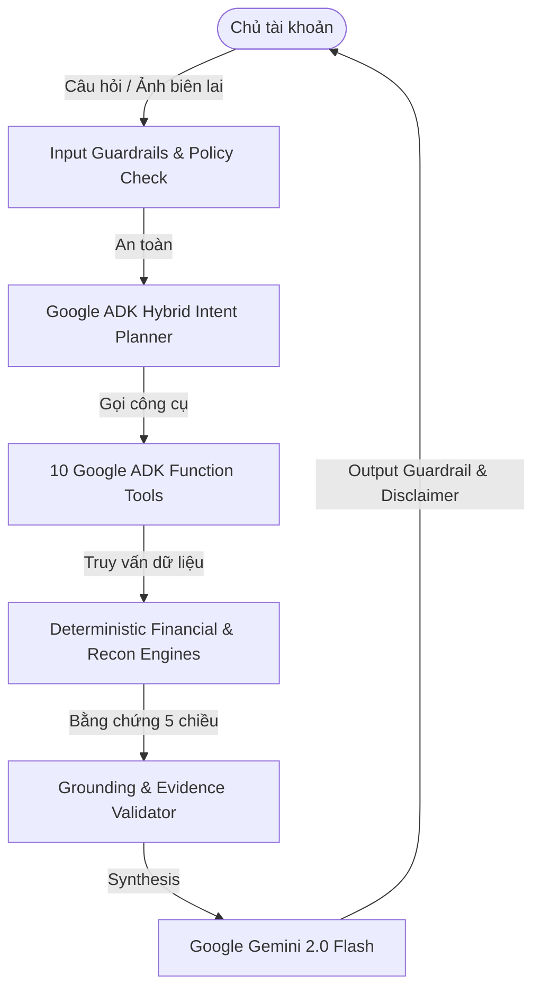

# 📊 Bộ Trình Chiếu (Pitch Deck Structure) — Wealify Guardian

> **Đề tài:** WLF-01 · Wealify — Quản lý chi tiêu & an toàn giao dịch  
> **Chủ đề:** Trợ Lý AI Bảo Vệ Giao Dịch & Đối Soát Tài Chính Đa Nguồn Bằng Google ADK

---

## 📑 CẤU TRÚC 10 SLIDES THUYẾT TRÌNH

### Slide 1: Bìa (Title & Tagline)
* **Tiêu đề:** WEALIFY GUARDIAN
* **Phụ đề:** Enterprise AI Expense Management & Transaction Safety Microservice
* **Thành viên:** Đội thi Hackathon Wealify AI Cross-Border Innovation 2026
* **Công nghệ chủ lực:** Google Agent Development Kit (ADK) · Google Gemini 2.0 Flash · Next.js · FastAPI

---

### Slide 2: Vấn Đề (The Pain Point)
* **Bối cảnh:** Doanh nghiệp TMĐT xuyên biên giới đối mặt với dòng tiền phân mảnh:
  * Nhiều loại tiền: Pay-in, Payout, Top-up thẻ ảo, Phí chuyển đổi ngoại tệ (FX fees), Phí sàn.
  * Phân tán ở nhiều nơi: Sổ cái Wealify, Số dư ví, Sao kê thẻ ngân hàng (VCB, TCB, VPBank), Hộp thư email biên lai.
* **Hệ quả:**
  * ❌ Bị trừ trùng tiền quảng cáo (Meta/Google Ads) mà không hay biết.
  * ❌ Tiền Payout từ Amazon/Stripe bị kẹt nhiều tuần làm đứt gãy dòng vốn.
  * ❌ Nguy cơ bị lừa đảo bởi ảnh chụp biên lai chuyển khoản giả mạo (Fake Receipt Scam).

---

### Slide 3: Giải Pháp — Wealify Guardian
* Trợ lý AI hội thoại thông minh, hoạt động 24/7 theo triết lý bất biến:
  > **"LLM hiểu & điều phối — Engine tài chính tính toán — Bằng chứng chứng minh — Policy kiểm soát — Người dùng ra quyết định."**
* 100% Read-Only đối với tiền và email — Tuyệt đối an toàn.

---

### Slide 4: Kiến Trúc Hệ Thống (Agentic Architecture)

---

### Slide 5: 5 Tính Năng Đột Phá
1. **Radar Đối Soát 3 Nguồn (3-Way Reconciliation):** Đối chiếu Account ↔ Wallet ↔ Card.
2. **Radar Quẹt Trùng & Đơn Khiếu Nại Tự Động:** Quét thẻ ảo trong 48h, gắn hạn 60 ngày theo Regulation E.
3. **Radar Payout Quá Hạn:** Bắt lỗi giải ngân chậm 14–16+ ngày từ Amazon/Stripe/Shopify.
4. **Radar Subscription & Tăng Giá Ngầm:** Dự báo chi phí năm, phát hiện gói tăng giá.
5. **Multimodal Vision Thẩm Định Biên Lai:** OCR & phát hiện Photoshop ủy nhiệm chi giả mạo.

---

### Slide 6: 10 Quy Chuẩn An Toàn Bất Biến (Contest Compliance)
| Quy định đề bài | Giải pháp của Wealify Guardian |
| :--- | :--- |
| **Ranh giới Read-only** | Chặn cứng lệnh tự chuyển tiền, hủy gói, chargeback. |
| **Email an toàn** | Chỉ gửi bản nháp về CHÍNH email người dùng sau khi xác nhận. |
| **3 Nhãn bắt buộc** | `Định kỳ đã xác định`, `Cần bạn tự xác nhận`, `Chưa đủ dữ liệu`. |
| **Hạn khiếu nại 60 ngày** | Luôn hiển thị mốc 60 ngày theo luật Mỹ Regulation E. |
| **Cấm trấn an tuyệt đối** | Từ chối khẳng định "100% an toàn", chỉ đánh giá theo dữ liệu thực. |
| **Quy tắc merchant & đối soát** | Merchant lạ ghi "Chưa xác định được"; lệch ghi rõ "Lệch $X, chưa xác định nguyên nhân". |
| **Dòng nhắc cố định** | Luôn tự động đính kèm Disclaimer ở cuối mọi câu trả lời. |

---

### Slide 7: Công Nghệ & Hiệu Năng Vượt Trội
* **Google ADK & Gemini 2.0 Flash:** Thời gian phản hồi < 1.2s, hỗ trợ Streaming SSE thời gian thực.
* **Dual Engine:** Kết hợp tính toán chính xác 100% của Python Engine với khả năng suy luận ngữ nghĩa của Gemini.
* **Test Coverage:** 40/40 Automated Test Cases Pass (100%).
* **Triển khai 1-click:** Đóng gói trọn vẹn Docker Compose.

---

### Slide 8: Trải Nghiệm Người Dùng (UI/UX Showcase)
* Giao diện phong cách **Fintech Dark Mode & Glassmorphism**.
* Hiển thị **vết tư duy của Agent (Thought Chain)** từng bước.
* Hỗ trợ tải trực tiếp **Đơn Tra Soát (Dispute Form HTML/PDF)** chỉ với 1 click.
* Nhật ký kiểm toán (Audit Trail) xuất file CSV/JSON tức thì.

---

### Slide 9: Tác Động Kinh Doanh (Business Impact)
* 💰 **Bảo vệ tài chính:** Tiết kiệm trung bình 8–15% chi phí thất thoát do quẹt trùng và phí ẩn.
* ⚡ **Tăng tốc xử lý:** Giảm 90% thời gian tra soát thủ công của kế toán doanh nghiệp.
* 🛡️ **Giảm thiểu rủi ro:** Ngăn chặn 100% các vụ lừa đảo bằng biên lai giả mạo.

---

### Slide 10: Tầm Nhìn & Kế Hoạch Tương Lai
* Mở rộng kết nối Open Banking với 30+ ngân hàng Đông Nam Á và Quốc tế.
* Tích hợp Agentic Self-Healing: Tự động nhắc nhở gia hạn và tối ưu hóa chi phí quảng cáo.
* **Wealify Guardian — Người gác cổng tài chính tin cậy cho mọi doanh nghiệp toàn cầu.**
