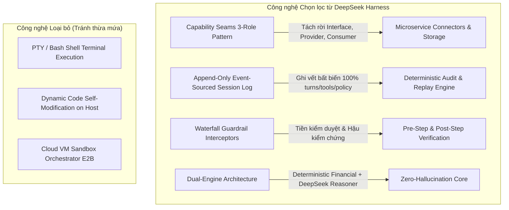
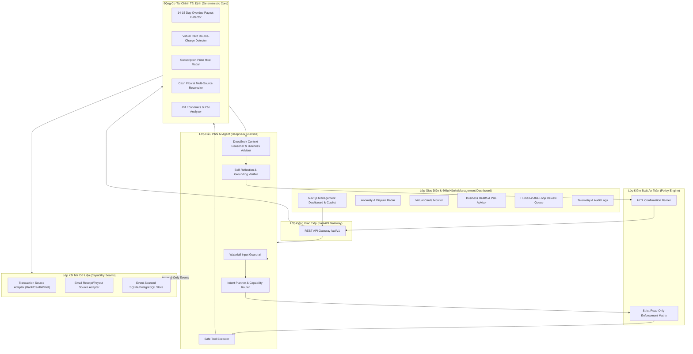
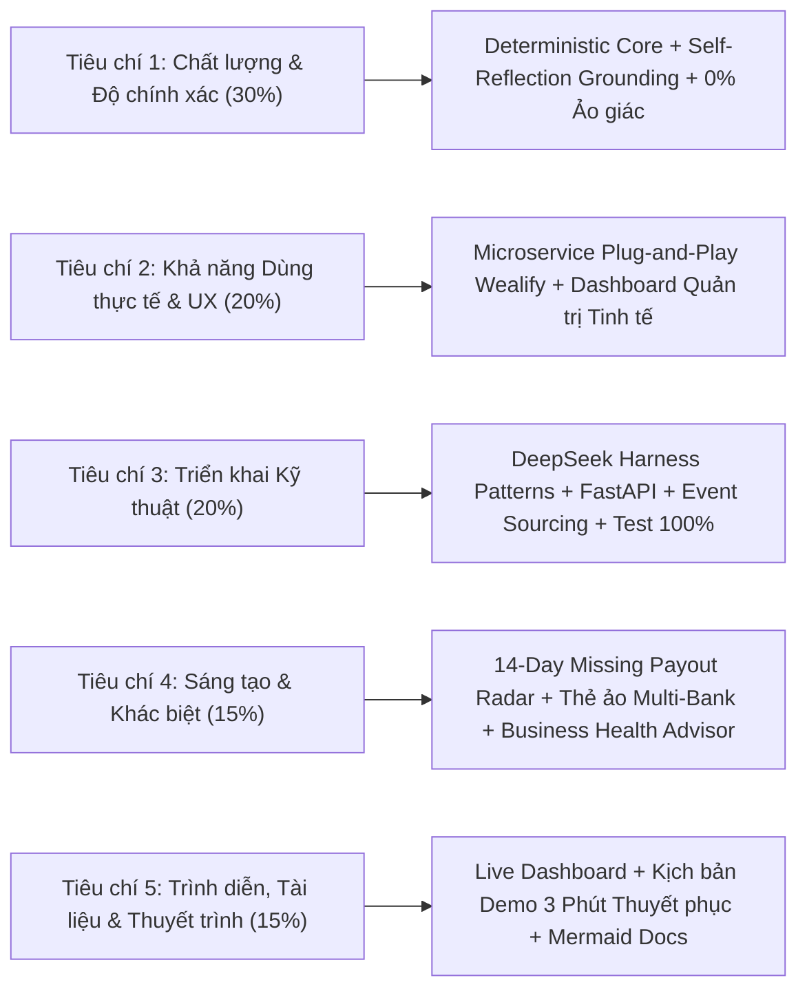

# Wealify Guardian — Enterprise AI Financial Assistant & Transaction Safety Microservice
## Thiết Kế Kiến Trúc Nâng Cao & Kế Hoạch Đạt Điểm Tối Đa 5 Tiêu Chí

---

## 1. Bối Cảnh & Vấn Đề Thực Tế Của Doanh Nghiệp Wealify

**Wealify** là nền tảng quản trị tài chính doanh nghiệp cross-border và chi tiêu thẻ ảo (Virtual Cards) liên kết các ngân hàng Việt Nam & Quốc tế. Người dùng của Wealify chủ yếu là:
- **Nhà bán hàng Cross-border E-commerce (Amazon, Etsy, Shopify, TikTok Shop, Stripe, PayPal):** Dòng tiền doanh thu phụ thuộc vào các đợt Payout từ sàn/cổng thanh toán.
- **Doanh nghiệp Digital Marketing / Agency / MMO:** Chi tiêu ngân sách lớn qua hàng chục, hàng trăm thẻ ảo Wealify cho Facebook Ads, Google Ads, TikTok Ads và hàng loạt phần mềm SaaS (OpenAI, Claude, Figma, AWS, Canva, Notion).

### Các Nỗi Đau (Pain Points) Lớn Nhất Cần AI Giải Quyết:
1. **Sự cố Payout Bị Thất Lạc / Chậm Quá 14–15 Ngày (Missing/Overdue Payouts):**
   - Sàn/Cổng thanh toán đã gửi email xác nhận Payout thành công (vd: Amazon/Stripe gửi receipt).
   - Tuy nhiên sau 14–15 ngày, tài khoản Wealify hoặc ngân hàng vẫn **chưa nhận được tiền** (do kẹt mạng thanh toán quốc tế, sai routing number, hoặc bị sàn pending). Doanh nghiệp không biết để khiếu nại kịp thời dẫn đến đứt gãy dòng tiền.
2. **Thẻ Ảo Bị Quẹt Trùng / Cà 2 Lần (Double Charges / Double Swiping on Virtual Cards):**
   - Hệ thống quản lý nhiều thẻ ảo liên kết các ngân hàng VN (Vietcombank, Techcombank, VPBank...) và quốc tế. Khi thanh toán Ads hoặc tool nước ngoài, lỗi gateway thường gây trừ tiền đúp 2 lần trong vài phút. Cần phát hiện ngay và đếm ngược thời hạn tra soát 60 ngày.
3. **Phần Mềm SaaS / Tool Đăng Ký Âm Thầm Tăng Giá (Subscription Price Hikes):**
   - Các công cụ làm việc âm thầm đổi bảng giá, tăng phí gói cước hàng tháng mà doanh nghiệp không để ý, gây thất thoát ngân sách định kỳ.
4. **Phân Loại Dòng Tiền & Cơ Chế AI Tự Kiểm Chứng (Self-Reflection / Grounding Verification):**
   - AI khi phân loại thu chi và trả lời người dùng **bắt buộc phải có bước tự suy luận & đối chiếu bằng chứng (Evidence Verification)** trước khi gửi, triệt tiêu 100% rủi ro ảo giác (hallucination).
5. **Cố Vấn Hiệu Quả Kinh Doanh & Dòng Tiền (Business Health & Unit Economics Advisory):**
   - Đánh giá tương quan giữa tiền chi tiêu Ad Spend trên thẻ ảo và dòng tiền doanh thu Payout đổ về: Có đang lãi hay lỗ? ROAS có an toàn không? Có nên tạm dừng ad campaign khi Payout đang tắc nghẽn? Kết hợp **Human-in-the-Loop (HITL)** để người dùng ra quyết định.

---

## 2. Chọn Lọc Công Nghệ Từ DeepSeek Harness (Lean & Enterprise-Ready)

Để sản phẩm trở thành **Microservice chuẩn doanh nghiệp**, chúng ta **CHỌN LỌC TINH HOA**, loại bỏ các thành phần cồng kềnh (không nhét bash terminal, PTY shell hay sandbox OS virtualization không cần thiết):



| Công Nghệ DeepSeek Harness | Trạng Thái | Lý Do Kỹ Thuật Áp Dụng Cho Wealify Guardian |
|---|---|---|
| **Capability Seams Pattern (3-Role)** |  **ÁP DỤNG** | Giúp tách bạch **Service Definition** (`TransactionSource`, `EmailSource`), **Provider** (`MockProvider`, `WealifyProductionAPI`), và **Consumer** (`ReconcileTool`, `DuplicateTool`). Cho phép cắm vào hệ thống Wealify mà không cần sửa code Tool. |
| **Append-Only Event Sourcing** |  **ÁP DỤNG** | Mọi tương tác của Agent, lời gọi Tool, quyết định Policy đều lưu thành stream sự kiện bất biến (`SessionEventLog`). Cho phép replay kiểm thử (Snapshot Testing) và phục vụ kiểm toán tài chính (Auditability). |
| **Waterfall Guardrails Pipeline** |  **ÁP DỤNG** | Xử lý yêu cầu theo chuỗi Waterfall: `Input Guardrail`  `Policy Check`  `Deterministic Financial Calculation`  `Grounding Self-Reflection`  `Output Guardrail`. |
| **Dual-Engine Architecture** |  **ÁP DỤNG** | Động cơ toán học/đối soát chạy bằng Python/SQL thuần 100% chính xác. DeepSeek LLM đóng vai trò tổng hợp, lập luận ngữ cảnh, giải thích và gợi ý chiến lược. |
| *OS Sandbox / PTY Shell / Self-Modification* | ❌ **LOẠI BỎ** | Không cần thiết cho nghiệp vụ tài chính, gây rủi ro bảo mật cho ngân hàng và tăng độ phức tạp vận hành. |

---

## 3. Kiến Trúc Tổng Thể Hệ Thống (Microservice Architecture)



---

## 4. Thiết Kế Nghiệp Vụ Chuyên Sâu Cho 5 Bài Toán Cốt Lõi

### 4.1. Bài toán 1: Phát hiện Payout Chậm Trễ Quá 14–15 Ngày (Missing/Overdue Payout Radar)
- **Cơ chế hoạt động:**
  1. `EmailSource` quét các email xác nhận Payout từ sàn e-commerce/cổng thanh toán (Amazon Payout, Stripe Payout, TikTok Shop Settlement, Shopify Balance, PayPal Transfer).
  2. Bóc tách metadata: `payout_id`, `payout_date`, `merchant_platform`, `amount`, `currency`, `target_account_last4`.
  3. `ReconciliationEngine` rà soát sổ cái ngân hàng / ví Wealify (`account_transactions` & `wallet_transactions`) trong khung thời gian từ `payout_date` đến hiện tại.
  4. Nếu $\Delta t \ge 14\text{ ngày}$ mà **chưa có giao dịch credit tương ứng**, hệ thống tự động:
     - Tạo Cảnh báo bất thường mức độ **KHẨN CẤP** (`status: "Cần bạn tự xác nhận"`).
     - Tạo gói bằng chứng (`Evidence Bundle`): Trích xuất snippet email, mã tham chiếu Payout, số ngày chậm trễ ($N$ ngày).
     - Tự động sinh bản thảo mẫu email khiếu nại sàn/ngân hàng (`dispute_draft`).

### 4.2. Bài toán 2: Thẻ Ảo Đa Ngân Hàng & Phát Hiện Cà Thẻ 2 Lần (Double Charge Radar)
- **Cơ chế hoạt động:**
  1. Wealify quản lý các thẻ ảo gán cho nhân viên/chiến dịch marketing kết nối ngân hàng nội địa (Vietcombank, Techcombank...) & quốc tế (Visa/Mastercard ảo).
  2. `DuplicateDetector` thực hiện quét liên tục:
     - **Cùng Card ID / Account ID**
     - **Cùng Merchant** (sau khi chuẩn hóa tên qua `normalize_merchant_name`)
     - **Cùng số tiền** (hoặc chênh lệch quy đổi ngoại tệ $< 0.5\%$)
     - **Khoảng cách thời gian $\le 48\text{ giờ}$** (đặc biệt các giao dịch trong vòng 1-10 phút).
  3. Tính toán **Điểm tin cậy (Confidence Score $\ge 0.90$)** và gắn nhãn hạn định tra soát **60 ngày tiêu chuẩn ngân hàng**.
  4. Gửi cảnh báo tức thì lên Dashboard và hỗ trợ bộ phận Support hệ thống Wealify.

### 4.3. Bài toán 3: Radar Bắt Tăng Giá Dịch Vụ SaaS & Tool Doanh Nghiệp (Subscription Radar)
- **Cơ chế hoạt động:**
  1. Nhận diện các chu kỳ thanh toán định kỳ (`Weekly`, `Monthly`, `Yearly`) dựa trên phương sai khoảng cách ngày giữa các giao dịch cùng merchant.
  2. So sánh đơn giá kỳ gần nhất ($P_{t}$) với kỳ trước đó ($P_{t-1}$).
  3. Nếu $P_{t} > P_{t-1}$:
     - Đưa ra cảnh báo tăng giá đột ngột (`PRICE_HIKE`).
     - Dự phóng chi phí phát sinh hàng năm ($\Delta \text{Annual Cost} = (P_t - P_{t-1}) \times \text{CadenceMultiplier}$).
     - Đưa ra gợi ý: Xem xét hủy gói nếu không còn nhu cầu hoặc hạ tier dịch vụ.

### 4.4. Bài toán 4: Động Cơ Tự Kiểm Chứng Phân Loại Dòng Tiền (AI Self-Reflection & Grounding)
- **Cơ chế hoạt động:**
  1. **Bước 1 (Deterministic Classifier):** Phân loại sơ bộ theo luật chính xác (`payin`, `payout`, `transfer`, `fee`, `card_purchase`, `subscription`).
  2. **Bước 2 (DeepSeek Reasoner Reflection):** Trước khi trả lời người dùng, LLM thực hiện một bước suy luận kiểm chứng chéo (Grounding Self-Check):
     - *Dữ liệu số tiền, ngày tháng, tên merchant có 100% khớp với Transaction trong Evidence không?*
     - *Có bất kỳ suy đoán nào chưa được chứng minh bằng dữ liệu thực không?*
  3. **Bước 3 (Standardized Tri-State Classification):**
     - `Định kỳ đã xác định`: Khi có đủ $\ge 2$ kỳ giao dịch trùng khớp hoàn toàn.
     - `Cần bạn tự xác nhận`: Khi có nghi vấn trùng lặp hoặc tăng giá cần người dùng xác nhận.
     - `Chưa đủ dữ liệu`: Khi giao dịch thẻ thiếu email receipt tương ứng hoặc lịch sử $< 2$ kỳ.

### 4.5. Bài toán 5: Cố Vấn Sức Khỏe Tài Chính & Đơn Vị Kinh Tế (Business Unit Economics Advisory)
- **Cơ chế hoạt động:**
  1. Tổng hợp dòng tiền chi phí tiếp thị (Ad Spend Facebook, Google, TikTok từ các thẻ ảo) vs Dòng tiền doanh thu (Payouts từ sàn).
  2. Đánh giá tỷ lệ đốt tiền (Burn Rate) và độ trễ Payout (Payout Cash Lag).
  3. Tính toán biên lợi nhuận ước tính (ROAS & Net Margin):
     - Nếu $\text{Doanh thu Payout} - \text{Ad Spend} < 0$: Cảnh báo **Chiến dịch kinh doanh đang thua lỗ**.
     - Nếu Payout bị kẹt quá 14 ngày trong khi Ad Spend vẫn tiếp tục trừ tiền: Cảnh báo **Rủi ro cạn kiệt thanh khoản dòng tiền ngắn hạn (Liquidity Squeeze)**.
  4. **Human-in-the-Loop:** Đưa ra nút gợi ý hành động cụ thể để người dùng click phê duyệt (vd: *"Xác nhận tạm dừng chiến dịch Ad #FB-02"*, *"Tạo ticket tra soát sàn Amazon"*).

---

## 5. Chiến Lược Đạt Điểm Tối Đa 5 Tiêu Chí Chấm Điểm (Pitch & Scoring Strategy)



### Chi tiết cách thuyết phục Ban giám khảo:

| Tiêu Chí | Trọng Số | Yếu Tố Thuyết Phục Đột Phá Của Wealify Guardian |
|---|:---:|---|
| **1. Chất lượng Giải pháp & Độ chính xác** | **30%** | **Kiến trúc Zero-Hallucination:** Không giao phó phép tính tài chính cho LLM. Kết hợp toán học tất định (Deterministic Engine) + Cơ chế tự kiểm chứng DeepSeek Reasoner + Bảng điểm tin cậy đa tiêu chí (Multi-factor Confidence Score). Phân loại chuẩn hóa 3 trạng thái rõ ràng. |
| **2. Khả năng Dùng thực tế & Trải nghiệm Người dùng (Trọng tâm)** | **20%** | **Chuẩn Microservice Doanh Nghiệp:** Dễ dàng nhúng thẳng vào backend Wealify qua REST API / OpenAPI chuẩn. Không đòi hỏi thay đổi hạ tầng gốc.<br>**Dashboard Quản Trị Đỉnh Cao:** Giao diện trực quan, dark mode sang trọng, điều hướng tức thì giữa Chatbot AI, Bảng cảnh báo thẻ ảo, Báo cáo đối soát và Hàng đợi duyệt Human-in-the-Loop.<br>**Tính Hành Động Cao:** Không chỉ báo lỗi chung chung mà sinh sẵn thư khiếu nại (Dispute Letter), nút xác nhận 1-click, đếm ngược hạn 60 ngày. |
| **3. Triển khai Kỹ thuật** | **20%** | **Mẫu thiết kế chuẩn mực:** Kế thừa Capability Seams và Event-Sourced Append-Only Logs từ DeepSeek Harness. Codebase Python tách module rõ ràng (`packages/financial`, `packages/agent`, `packages/policy`, `packages/evidence`), Pydantic v2 type safety, 100% pass unit & evaluation tests. |
| **4. Sáng tạo & Khác biệt** | **15%** | **Giải quyết trúng bài toán Cross-Border E-commerce:** Tính năng độc quyền phát hiện Payout chậm 14–15 ngày giữa Email thông báo và Ngân hàng. Cố vấn sức khỏe kinh doanh & cảnh báo đứt gãy dòng tiền do nợ đọng Payout kết hợp chi phí thẻ ảo Ads. |
| **5. Trình diễn, Tài liệu & Thuyết trình** | **15%** | **Bộ tài liệu kỹ thuật hoàn chỉnh:** Sơ đồ Mermaid tương tác, sổ tay kiến trúc, kịch bản thuyết trình 3 phút gãy gọn, live demo chạy mượt mà không có độ trễ. |

---

## 6. Thiết Kế Management Dashboard (Giao Diện Quản Trị Chatbot & Dịch Vụ)

Giao diện Web Management Dashboard (`apps/web`) được thiết kế với chuẩn thẩm mỹ cao cấp (Modern Fintech Dark/Glassmorphism theme, typography sắc nét, responsive, micro-animations):

### Các phân hệ chính trên Dashboard:
1. **Header & Quick Status Bar:** Trạng thái Microservice (Online, Latency, Token Usage, Policy Engine: Active, Security Boundary: Enforced).
2. **AI Copilot & Conversational Workspace:**
   - Khung hội thoại tương tác với Agent.
   - Hiển thị trực quan luồng suy luận từng bước (Reasoning Trace / Execution Steps: `RECEIVED`  `PLANNING`  `TOOL_EXECUTION`  `EVIDENCE_CHECK`  `COMPLETED`).
   - Thẻ hiển thị bằng chứng tương tác (Interactive Evidence Cards).
3. **Transaction Safety & Anomaly Center:**
   - **Tab 1: 14–15 Day Missing Payouts:** Danh sách các khoản thanh toán từ sàn chưa về tài khoản, số ngày trễ, nút "Xem Email xác nhận" và "Tạo thư tra soát".
   - **Tab 2: Virtual Card Double Charges:** Danh sách các giao dịch quẹt trùng trên thẻ ảo Wealify, thời gian cách nhau, badge đếm ngược 60 ngày.
   - **Tab 3: SaaS Subscription Radar:** Danh sách phần mềm định kỳ, phát hiện tăng giá và chi phí cam kết cả năm.
4. **Business Financial Health & Unit Economics:**
   - Biểu đồ tương quan Dòng tiền Ad Spend thẻ ảo vs Doanh thu Payouts thực nhận.
   - Điểm sức khỏe tài chính doanh nghiệp (Financial Health Score: Healthy / Warning / Critical).
   - Đề xuất tối ưu chi phí và cảnh báo lỗ.
5. **Human-in-the-Loop (HITL) Review Queue:**
   - Hàng đợi các hành động nhạy cảm cần quản trị viên hoặc người dùng duyệt (vd: Xác nhận gửi báo cáo, xác nhận đánh dấu giao dịch gian lận).
6. **Audit Logs & Telemetry Matrix:**
   - Bảng nhật ký sự kiện bất biến (Event-Sourced Session Logs) phục vụ kiểm toán hệ thống.

---

## 7. Kế Hoạch Triển Khai Chi Tiết (Implementation Tasks)

### Component 1: Financial Engine & Anomaly Expansion (`packages/financial`)
- [NEW] Thêm `OverduePayoutDetector` trong `packages/financial/reconciliation/` phát hiện các khoản Payout quá 14–15 ngày từ email mà chưa có tiền vào tài khoản/ví.
- [MODIFY] Nâng cấp `DuplicateDetector` trong `packages/financial/anomaly/duplicate_detector.py` để hỗ trợ đa thẻ ảo (Virtual Cards) và thẻ ngân hàng Việt Nam/Quốc tế.
- [NEW] Thêm `BusinessAdvisor` trong `packages/financial/advisory/` phân tích Unit Economics, ROAS, tương quan Ad Spend thẻ ảo vs Payout sàn.

### Component 2: Agent Tools, Reasoner & Self-Reflection (`packages/agent`)
- [NEW] Thêm tool `detect_overdue_payouts` và `analyze_business_health` vào `packages/agent/tools/`.
- [MODIFY] Cập nhật `IntentPlanner` và `SafeToolExecutor` để định tuyến các câu hỏi về Payout trễ, thẻ ảo bị trừ 2 lần, tư vấn kinh doanh lời/lỗ.
- [MODIFY] Cập nhật `MockLLMProvider` / `DeepSeekProvider` bổ sung cơ chế lập luận ngữ cảnh, giải thích chiến lược kinh doanh và tự kiểm chứng grounding.

### Component 3: Data Connectors & Sample Datasets (`data/sample` & `packages/data`)
- [MODIFY] Bổ sung mẫu email thông báo Payout sàn thương mại điện tử (Amazon, Stripe, Shopify, TikTok Shop) vào `data/sample/emails.json`.
- [MODIFY] Bổ sung các ca giao dịch thẻ ảo quảng cáo (Facebook Ads, Google Ads) và quẹt trùng thẻ ảo vào `data/sample/card_statements.csv`.

### Component 4: REST API Gateway Extensions (`apps/api`)
- [MODIFY] Bổ sung endpoint `/api/v1/advisory/health` và `/api/v1/reconciliation/payouts` trong FastAPI.
- [MODIFY] Cập nhật endpoint `/api/v1/chat` hỗ trợ trả về Reasoning Trace và Evidence Metadata cho Dashboard.

### Component 5: Web Management Dashboard (`apps/web`)
- [NEW] Xây dựng toàn diện giao diện Web Next.js Dashboard tích hợp:
  - Overview Analytics & Metric KPIs.
  - Live AI Chatbot với Step Trace & Evidence Modal.
  - Anomaly Center (14-day Overdue Payouts + Virtual Card Double Swipes + Subscription Radar).
  - Business Health & Advisory Panel.
  - Human-in-the-Loop Approval Queue.
  - Audit Trail & Telemetry Monitor.

### Component 6: Kiểm Thử & Đánh Giá (Verification & Eval)
- [MODIFY] Mở rộng bộ kiểm thử tự động `tests/unit/` và `scripts/run_eval.py` cho tất cả các kịch bản mới (Payout 14 ngày, Thẻ ảo 2 lần, Tư vấn kinh doanh, Grounding Reflection).

---

## 8. Kế Hoạch Xác Minh (Verification Plan)

### Kiểm Thử Tự Động (Automated Tests)
1. Chạy toàn bộ Unit Tests bằng `pytest`:
   ```bash
   pytest tests/unit/ -v
   ```
2. Chạy kịch bản Agent Evaluation Runner:
   ```bash
   python scripts/run_eval.py
   ```

### Xác Minh Giao Diện & Microservice (Manual & End-to-End Verification)
1. Khởi động FastAPI backend: `python -m apps.api.main` và kiểm tra tài liệu API tại `http://localhost:8000/docs`.
2. Khởi động Next.js Dashboard: `cd apps/web && npm run dev` và kiểm tra trải nghiệm tại `http://localhost:3000`.
3. Kiểm tra các luồng demo chính:
   - Chatbot hỏi: *"Có khoản Payout nào bên bán báo gửi rồi mà 14 ngày chưa về Wealify không?"*  Agent gọi tool, phát hiện email Payout Amazon 15 ngày trước, đưa ra cảnh báo + bằng chứng.
   - Chatbot hỏi: *"Thẻ ảo chạy ads của tôi có bị cà 2 lần không?"*  Agent phát hiện 2 giao dịch Grab/Facebook Ads trùng nhau trong 2 phút, đưa hạn tra soát 60 ngày.
   - Kiểm tra tab Business Advisory: Xem đánh giá hiệu quả kinh doanh, tỷ lệ chi tiêu ads vs payout, cảnh báo dòng tiền.
   - Kiểm tra tab Human-in-the-Loop: Thử nghiệm xác nhận hoặc từ chối hành động.
